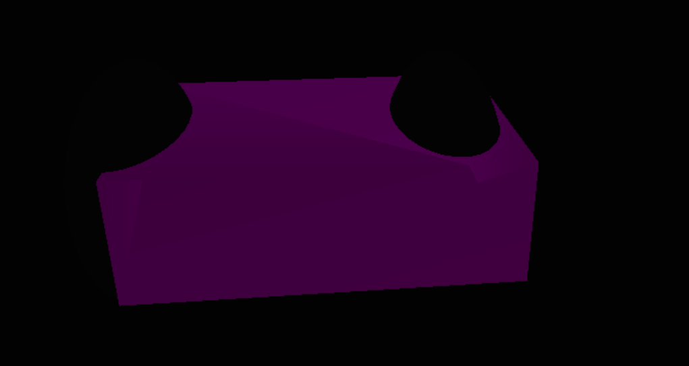
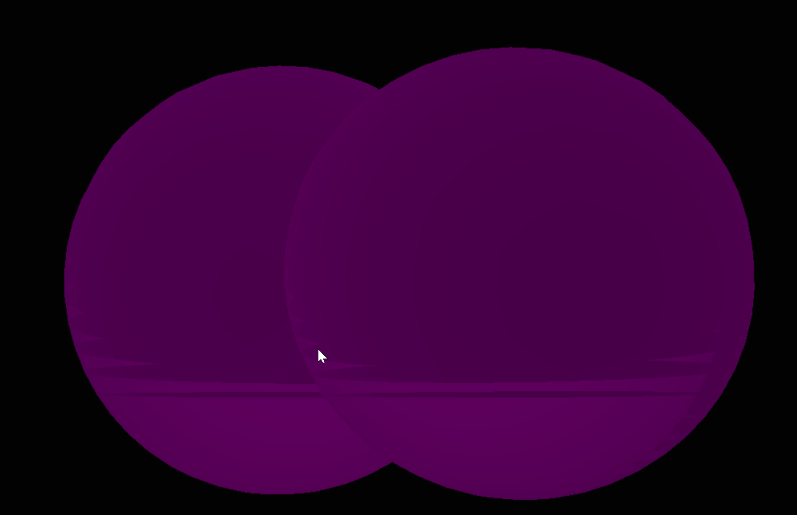
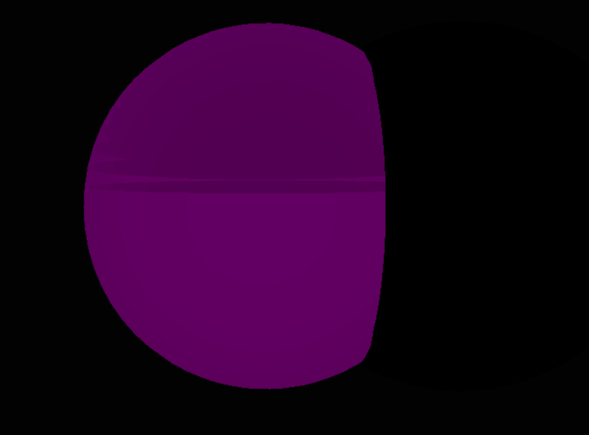

## Constructive Solid Geometry with Stencil Buffer
## This project borrows heavily from an existing Northeastern Codebase (specifically an assignment in CS 4300)

## https://youtu.be/D_AG3JMtZf0 (turn up volume if usually have volume low)

## Images:

